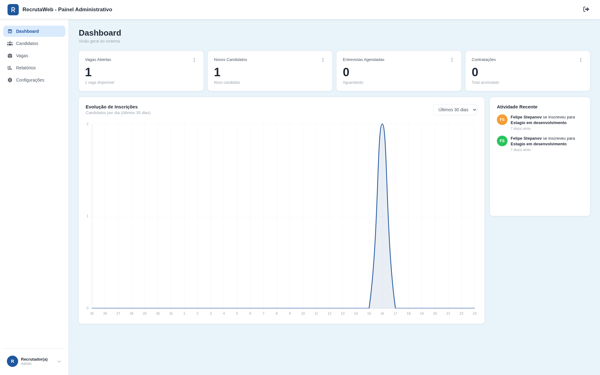
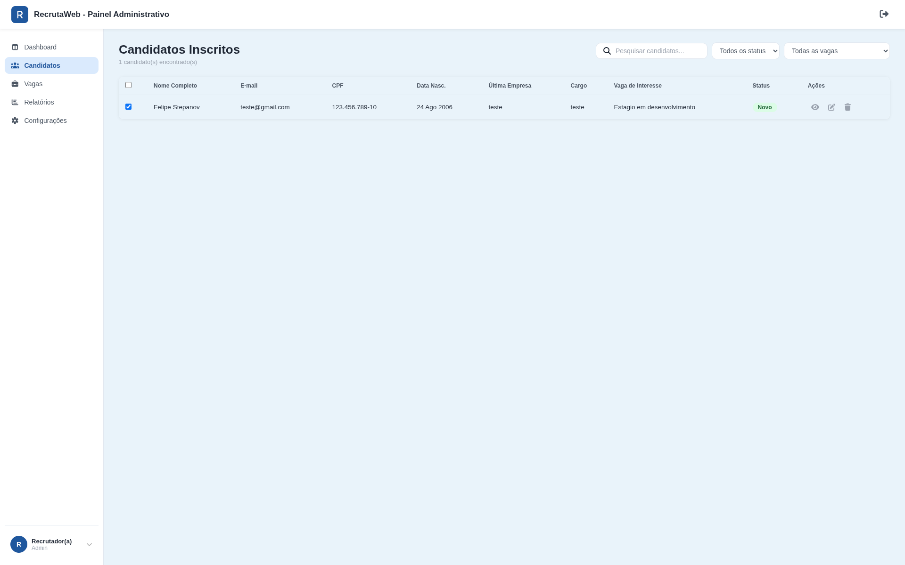
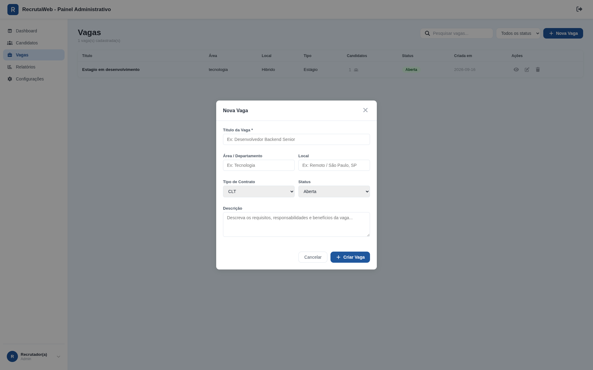
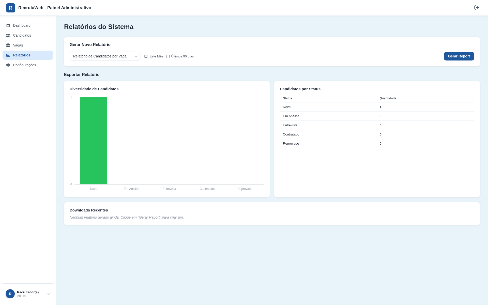
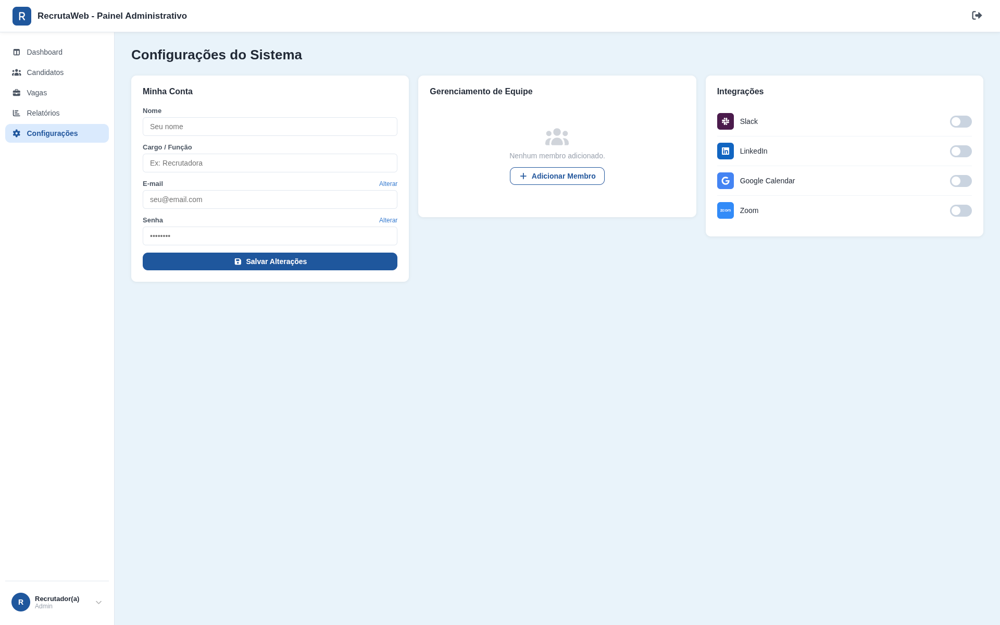
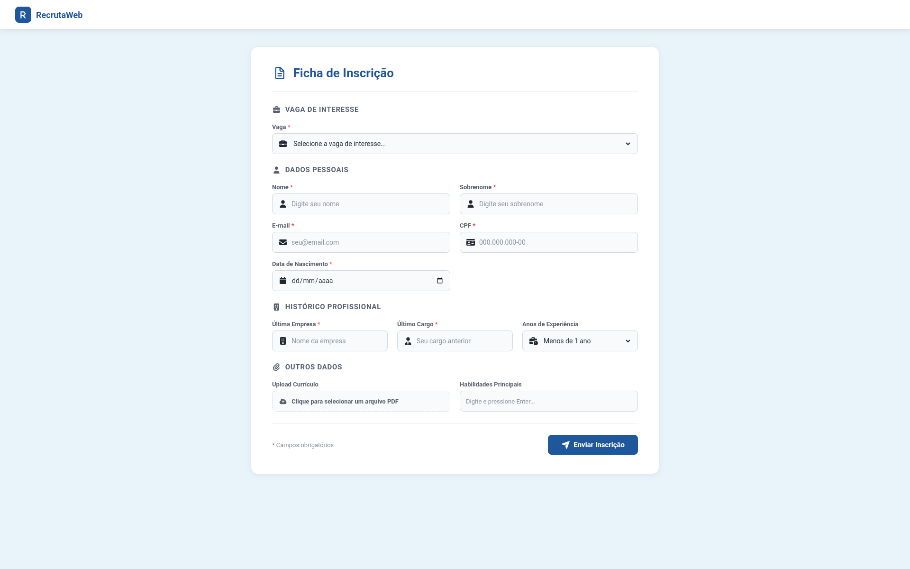
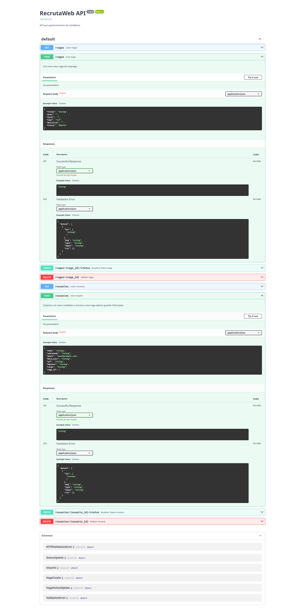

# 🚀 RecrutaWeb — Sistema de Gestão de Vagas e Candidatos

O **RecrutaWeb** é um sistema web Full-Stack desenvolvido para simplificar o gerenciamento de processos seletivos e a recepção de candidaturas. A solução conta com um painel administrativo moderno no modelo SPA (Single Page Application) para recrutadores e uma ficha de inscrição fluida e interativa para candidatos.

---

## 📸 Screenshots do Sistema

### 👔 Painel Administrativo (Recrutador)

#### 1. Dashboard Principal
Visão geral com indicadores (KPIs), gráfico de evolução de inscrições e feed de atividade recente.


#### 2. Gestão de Candidatos
Listagem completa de candidatos inscritos com badges de status, filtros por vaga/status e busca em tempo real.


#### 3. Criação de Novas Vagas
Modal interativo para abertura de novas oportunidades com validação de campos.


#### 4. Relatórios e Indicadores
Gráficos estatísticos e relatórios de distribuição de candidatos por fase do processo seletivo.


#### 5. Configurações do Perfil
Gerenciamento de perfil do recrutador e preferências do sistema.


---

### 📝 Formulário do Candidato

#### Ficha de Inscrição
Formulário responsivo com seleção de vagas abertas via API, máscara de CPF em tempo real e tags de habilidades.


---

### ⚡ Documentação da API (FastAPI / Swagger)

#### Documentação Interativa Swagger UI
Endpoints REST auto-documentados com validação estrita de schemas via Pydantic.


---

## 🖥️ Funcionalidades

### 👔 Painel do Recrutador (Admin)
- **Dashboard Interativo:** KPIs de Vagas Abertas, Novos Candidatos, Entrevistas e Contratações.
- **Gestão de Vagas (CRUD):** Abertura, alteração de status (*Aberta*, *Pausada*, *Fechada*) e remoção de vagas.
- **Funil de Candidatos:** Controle de status (*Novo*, *Em Análise*, *Entrevista*, *Contratado*, *Reprovado*).
- **Busca e Filtros:** Pesquisa por texto e filtragem dinâmica por status ou vaga específica.

### 📝 Formulário do Candidato
- **Vagas em Tempo Real:** Consumo automático de vagas com status *Aberta*.
- **UX & Validações:** Máscara de CPF automática, pílulas de habilidades (*tags*) e feedback amigável de erro/sucesso.
- **Segurança:** Sanitização de HTML contra ataques XSS e validação de schemas de entrada.

---

## 🛠️ Tecnologias Utilizadas

- **Backend:** Python 3.10+, FastAPI, Uvicorn, SQLite3, Pydantic
- **Frontend:** HTML5, CSS3 (CSS Grid, Flexbox, Variáveis globais), JavaScript (Vanilla JS, Fetch API)
- **Gráficos & Visualização:** Chart.js
- **Documentação:** OpenAPI / Swagger UI

---

## 📁 Estrutura do Repositório

```
.
├── docs/
│   └── images/              # Prints e capturas de tela demonstrativas
├── Gestão/
│   ├── back_end/            # API Python / FastAPI e Banco SQLite
│   │   ├── app.py
│   │   ├── controllers.py
│   │   ├── database.py
│   │   └── model.py
│   ├── front_end_admin/     # SPA do Painel Administrativo
│   │   ├── index.html
│   │   ├── app.js
│   │   └── main.css
│   └── front_end_formulario/ # Formulário de Inscrição do Candidato
│       ├── index.html
│       ├── app.js
│       └── main.css
└── README.md
```

---

## ⚙️ Como Executar o Projeto Localmente

### 1. Clonar o repositório
```bash
git clone https://github.com/SEU-USUARIO/RecrutaWeb.git
cd RecrutaWeb
```

### 2. Ativar o ambiente virtual e instalar dependências
```bash
python3 -m venv venv
source venv/bin/activate
pip install fastapi uvicorn pydantic requests
```

### 3. Iniciar o servidor Backend (FastAPI)
```bash
cd Gestão/back_end
uvicorn app:app --reload
```
> O servidor estará rodando em `http://localhost:8000`.

### 4. Abrir as aplicações Frontend
Abra os arquivos HTML no seu navegador:
- **Painel Admin:** `Gestão/front_end_admin/index.html`
- **Formulário Candidato:** `Gestão/front_end_formulario/index.html`

